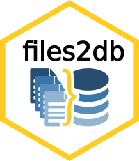

[](https://www.python.org/downloads/) [](https://codecov.io/gh/louislenezet/files2db) [](https://opensource.org/licenses/gpl-3-0)

# Files2DB

<table>
  <tr>
    <td>
      <p>
        <i>One script to rule them all, one script to find them, one script to norm them all and in a database bind them.</i>
      </p>
      <p>
        <strong>files2db</strong> is a python tool to help anyone concatenate, normalize and check a multitude of flat plain files (.csv, .xlsx) into a single, standardized database.
      </p>
      <ul>
        <li><a href="#1-problematic">Problematic</a></li>
        <li><a href="#2-python-script">Python script</a>
          <ul>
            <li><a href="#21-script-structure">Script structure</a></li>
            <li><a href="#22-installation">Installation</a></li>
            <li><a href="#23-launch-of-the-script">Launch</a></li>
          </ul>
        </li>
      </ul>
    </td>
    <td style="text-align:right;">
      
    </td>
  </tr>
</table>

## 1. Problematic and objectives

Projects with numerous data sources often begin with many plain files (CSV and Excel) whose variable names and value formats are not standardized.
Record identities are frequently encoded in complex, multi-field keys that differ between files.

`files2db` aims to produce a single working dataset with normalized fields and a formal unique identifier for each observation, enabling easy updates, clear error reporting, and full traceability and reproducibility.

It reliably identifies observations even when candidate keys differ or some identifying fields are missing, normalizes data by splitting/merging fields and converting formats, and validates content by checking formats and internal consistency while reporting errors with causes and locations.

## 2. Python script

`files2db` automates concatenating and ingesting many source files.
I takes as input a CSV or Excel file that lists the files to integrate, the tool reads each file, extracts and normalizes available fields, and updates a single database so adding new source files becomes trivial. The process writes a CSV containing the full consolidated dataset and a separate error report that records each issue’s reason and location; it also validates and, when possible, coerces field formats and generates a unique identifier for every observation.

### 2.1 Installation

`files2db` is available on conda-forge, so you can install it with the following command:

```bash
conda install -c conda-forge files2db
```

### 2.2 Input file

To run `files2db`, you need three different tables:

- A file list table that contains the list of files to integrate, with their paths and formats.
- A field mapping table that contains the mapping between the fields in the source files and the fields in the output database
- A rules table that contains the rules for normalizing the data, such as how to split or merge fields, how to convert formats, and how to generate unique identifiers.

These tables can be in CSV or Excel format, and they should be structured as follows:

- The file list table should have the following columns: `FilePath`, `SheetName`, `LineStart`, `LineEnd`, `Header`, `ColStart`, `ColEnd`, `ToAdd`, `AsCorrection`, `Separator`
- The field mapping table should have the following columns: `Field`, `Eq`, `Value`
- The rules table should have the following columns: `Field`, `Category`, `Sep`, `DelMatch`, `DelEnd`, `DelIn`, `DelStart`, `StripFrom`, `DataType`, `Contains`, `Min`, `Max`, `SepPattern`, `KeepLink`

Details on how to structure these tables can be found in the [documentation](https://files2db.readthedocs.io/en/latest/).

### 2.3 Launch of the script

Run

```bash
files2db --help
files2db --path "path/to/file.csv" --normalize --output "output/path"
```

This command line will launch the script directly in the command prompt with the file `path/to/file.csv` that you have chosen.
It will then normalize the data and output the resulting database in `output/path`.
You can also choose to only concatenate the files without normalizing them by omitting the `--normalize` flag.

## 3. Contributions and License

Contributions to this project are welcome! If you have any suggestions, improvements, or bug fixes, please feel free to submit a pull request. For major changes, please open an issue first to discuss what you would like to change. A detailed contribution guide can be found in the [CONTRIBUTING.md](CONTRIBUTING.md) file.

This project is licensed under the GNU General Public License v3.0. See the [LICENSE](LICENSE) file for details.
